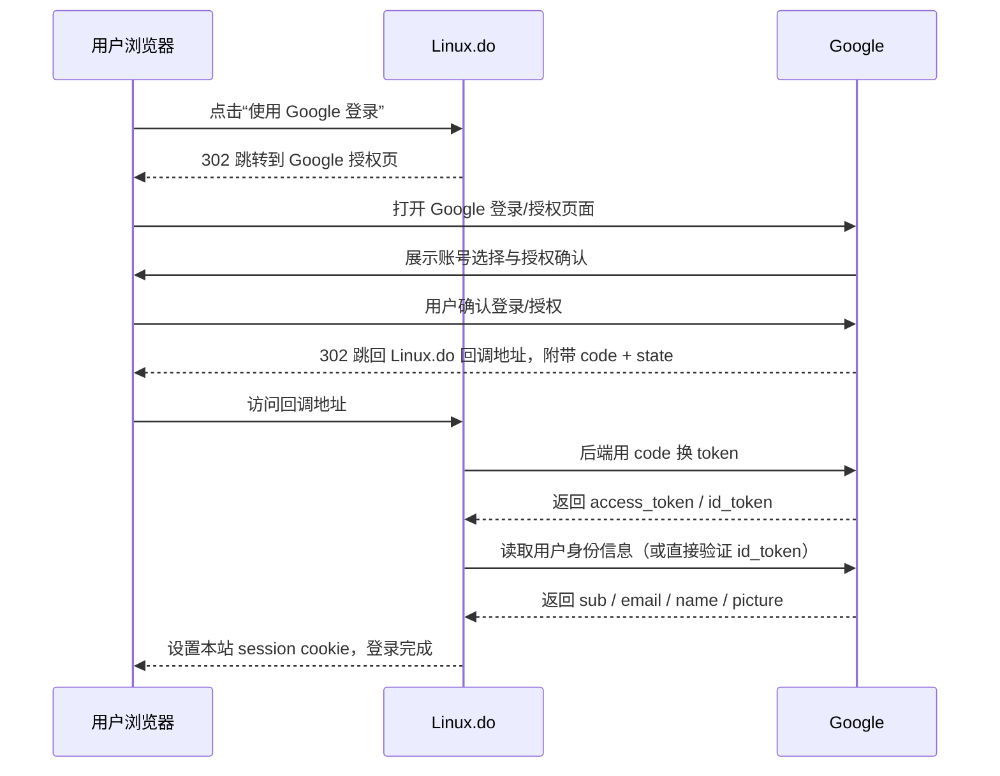
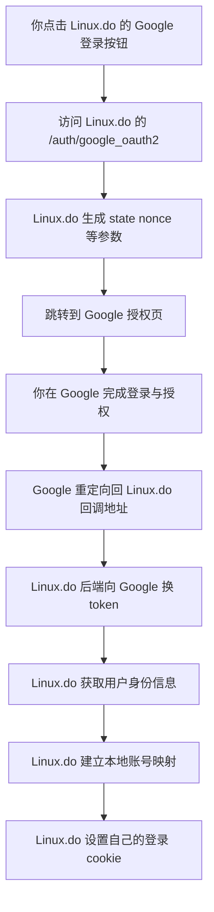

# 第三方 OAuth 登录笔记

> [!summary]
> 这篇笔记解决 4 个核心问题：
> 1. 第三方登录时，浏览器、你的网站、Google 三方分别做什么
> 2. `OAuth 2.0` 和 `OIDC` 到底是什么关系
> 3. “回调链接”到底是什么，为什么必须配置
> 4. 以 `Linux.do + Google 登录` 为例，实际请求是怎么走的

## 导航

- [[#先记住一句话]]
- [[#先分清 4 个角色]]
- [[#一图看懂完整流程]]
- [[#按步骤拆解实际发生了什么]]
- [[#linuxdo + google 登录实例]]
- [[#登录时数据到底怎么处理]]
- [[#关键参数词典]]
- [[#回调链接到底是什么]]
- [[#常见坑与排错]]
- [[#一句话复盘]]

---

## 先记住一句话

> [!important]
> 第三方登录通常不是“单独的 OAuth 2.0”，而是：
> 
> `OAuth 2.0 + OpenID Connect (OIDC)`
>
> `OAuth 2.0` 解决“授权”  
> `OIDC` 解决“你是谁”

所以：

- 你用 Google 登录某网站，不是为了让网站访问你的 Google Drive
- 而是为了让 Google 告诉这个网站：“这个用户是谁，他已经在我这里登录并同意授权了”

---

## 先分清 4 个角色

| 角色 | 在这个例子里是谁 | 它负责什么 |
| --- | --- | --- |
| 用户浏览器 | 你的 Chrome / Safari | 跳转页面、带着参数来回跳 |
| 业务网站 | `Linux.do` | 发起登录、校验结果、创建本站会话 |
| 认证提供方 | `Google` | 让你登录、让你授权、返回身份结果 |
| 用户 | 你 | 点击登录、选择账号、同意授权 |

> [!tip]
> 你可以把第三方登录理解成一句话：
> 
> “网站把你临时带去 Google 验身，Google 验完以后再把你送回来。”

---

## 一图看懂完整流程



> [!note]
> 真正敏感的动作，比如：
> 
> - `client_secret`
> - 用 `code` 换 `token`
> - 校验 `id_token`
>
> 都应该发生在 **业务网站后端**，不是浏览器里。

---

## 按步骤拆解实际发生了什么

### 1. 用户点击“使用 Google 登录”

此时浏览器先访问的是 **业务网站自己的登录入口**，不是直接先调 Google API。

例如：

```text
https://linux.do/auth/google_oauth2
```

这个入口的作用是：

- 由 `Linux.do` 生成这次登录需要的参数
- 记录防伪造用的数据，比如 `state`
- 再把浏览器重定向到 Google

---

### 2. 网站把浏览器重定向到 Google 授权地址

Google 的官方 OIDC 配置里，目前关键端点是：

```text
authorization_endpoint = https://accounts.google.com/o/oauth2/v2/auth
token_endpoint         = https://oauth2.googleapis.com/token
userinfo_endpoint      = https://openidconnect.googleapis.com/v1/userinfo
```

所以浏览器会被带到类似这样一个地址：

```text
GET https://accounts.google.com/o/oauth2/v2/auth
  ?client_id=你的Google客户端ID
  &redirect_uri=https%3A%2F%2Flinux.do%2Fauth%2Fgoogle_oauth2%2Fcallback
  &response_type=code
  &scope=openid%20email%20profile
  &state=随机字符串
  &nonce=随机字符串
```

这一步本质上是：

- 网站告诉 Google：“我要做登录”
- 网站告诉 Google：“登录成功后，把用户带回这个地址”
- 网站告诉 Google：“我想要这些身份信息范围”

---

### 3. Google 让用户完成登录和授权

Google 会：

- 让你输入密码，或者直接选已登录账号
- 展示授权确认页面
- 确认你是否愿意把基础身份信息给这个网站

注意：

- 这里给出去的通常不是你的 Google 密码
- 网站拿不到你的 Google 密码
- 网站拿到的是 Google 返回的“授权结果”

---

### 4. Google 把用户重定向回业务网站的回调链接

Google 完成认证后，会把浏览器带回：

```text
https://linux.do/auth/google_oauth2/callback?code=xxx&state=yyy
```

这里最重要的两个参数是：

- `code`：一次性临时授权码
- `state`：防 CSRF 的随机值

> [!warning]
> `code` 不是最终登录态。  
> 它只是一个很短命的“凭条”，业务网站要拿它再去 Google 后端换 token。

---

### 5. 业务网站后端用 `code` 向 Google 换 token

这一步是 **后端到后端** 的通信，不经过你的浏览器界面。

请求大致长这样：

```http
POST https://oauth2.googleapis.com/token
Content-Type: application/x-www-form-urlencoded

client_id=...
client_secret=...
code=...
grant_type=authorization_code
redirect_uri=https://linux.do/auth/google_oauth2/callback
```

Google 返回的通常包括：

- `access_token`
- `id_token`
- `expires_in`
- 有些场景下还会有 `refresh_token`

---

### 6. 业务网站获取或验证用户身份

网站拿到 token 后，通常有两种做法：

#### 做法 A：直接验证 `id_token`

`id_token` 本质上是一个 JWT，里面通常带有：

- `sub`：Google 用户唯一 ID
- `email`
- `email_verified`
- `name`
- `picture`
- `iss`
- `aud`
- `exp`
- `nonce`

#### 做法 B：再调用 `userinfo` 接口

```http
GET https://openidconnect.googleapis.com/v1/userinfo
Authorization: Bearer <access_token>
```

网站拿到的身份资料通常类似：

```json
{
  "sub": "1234567890",
  "email": "user@example.com",
  "email_verified": true,
  "name": "Your Name",
  "picture": "https://..."
}
```

---

### 7. 网站在自己的数据库里建立“本地账号”

这里是最容易被忽略的一步。

第三方登录成功后，网站不会一直“在线请求 Google 才知道你是谁”。  
它通常会在 **自己数据库里** 建立一套本地身份数据。

常见做法：

| 字段 | 作用 |
| --- | --- |
| `provider` | 记录来源，比如 `google` |
| `provider_user_id` | 记录 Google 的唯一用户 ID，通常就是 `sub` |
| `user_id` | 对应本站内部用户 ID |
| `email` | 展示或联系用途 |
| `name` | 首次填充昵称 |
| `avatar_url` | 首次填充头像 |
| `last_login_at` | 记录最近登录时间 |

> [!important]
> 真正稳定的绑定字段应该优先是 `sub`，不是 `email`。  
> 因为邮箱可能变化，但 `sub` 更稳定。

---

### 8. 网站创建自己的登录态

最后，业务网站会：

- 给浏览器写一个自己的 `session cookie`
- 或者发一个自己的站内 token

从这一刻开始，你访问的是：

- **Linux.do 的登录态**

而不是每次都直接拿 Google 的 token 去证明身份。

这就是为什么你登录完以后，页面上表现为“我已经登录了 Linux.do”，而不是“我一直在实时请求 Google”。

---

## Linux.do + Google 登录实例

> [!example]
> 截至 `2026-04-13`，我查到的公开信息里：
> 
> - `https://linux.do/login` 显示它是 `Discourse` 站点
> - `https://linux.do/site.json` 的 `auth_providers` 中包含 `google_oauth2`
> - `provider_url` 指向 `https://accounts.google.com`

这意味着它的 Google 登录大体就是这个结构：



你可以重点记住两层地址：

### 网站自己的入口

```text
https://linux.do/auth/google_oauth2
```

### 网站自己的回调地址

```text
https://linux.do/auth/google_oauth2/callback
```

> [!note]
> 上面这条回调路径，和 Discourse / OmniAuth 的标准路由模式一致。  
> 我能确认 `google_oauth2` provider 存在；直接抓该路径的重定向过程时遇到了 Cloudflare challenge，所以这里按高置信标准路径记录。

---

## 登录时数据到底怎么处理

你可以把数据分成 4 类看：

### 1. 页面跳转参数

用于这一次登录流程：

- `client_id`
- `redirect_uri`
- `scope`
- `response_type`
- `state`
- `nonce`

这些参数主要出现在：

- 浏览器跳到 Google 的授权 URL 里

---

### 2. 临时授权结果

Google 回调回来时，常见是：

- `code`
- `state`

这一步还只是“中间票据”。

---

### 3. Token 数据

网站后端向 Google 换到：

- `access_token`
- `id_token`
- `refresh_token`（不一定有）

其中：

- `access_token`：拿去访问用户信息接口
- `id_token`：拿来证明“这个用户是谁”

---

### 4. 业务网站自己的本地用户数据

网站最终落库的一般是：

- 第三方身份绑定关系
- 本站用户资料
- 本站登录态

也就是说：

> [!tip]
> 第三方登录的终点，不是“永远依赖 Google”。  
> 而是“借 Google 完成身份确认，然后回到本站自己的用户系统里”。

---

## 关键参数词典

| 参数 | 含义 | 记忆方式 |
| --- | --- | --- |
| `client_id` | 你的网站在 Google 那边的身份编号 | “网站身份证号” |
| `client_secret` | 网站后端私密凭证 | “网站私钥，不能放前端” |
| `redirect_uri` | 登录成功后 Google 把用户送回来的地址 | “送回家地址” |
| `response_type=code` | 采用授权码模式 | “先给凭条，再换正式票” |
| `scope` | 申请哪些权限/信息 | “我要看什么” |
| `state` | 防 CSRF、防伪造 | “防串线验证码” |
| `nonce` | 防重放、绑定本次登录 | “本次登录唯一编号” |
| `code` | 一次性授权码 | “短命兑换券” |
| `access_token` | 访问 API 的令牌 | “调用接口通行证” |
| `id_token` | 身份声明 | “Google 给你开的身份证明” |
| `sub` | 第三方用户的唯一稳定 ID | “真正的绑定主键” |

---

## 回调链接到底是什么

> [!important]
> 回调链接 = 第三方认证完成后，认证平台把浏览器重定向回你网站的地址

它有 3 个关键作用：

1. 接收 Google 返回的 `code`
2. 校验 `state`
3. 开始本地登录流程

### 为什么必须提前配置？

因为 Google 不能随便把用户送到任何地址。  
你必须在 Google Cloud Console 里提前登记允许的回调地址，例如：

```text
https://linux.do/auth/google_oauth2/callback
```

如果不匹配，就会报：

```text
redirect_uri_mismatch
```

### 为什么回调链接很关键？

因为它决定：

- 登录结果交回给谁
- 这个请求是不是合法网站发起的
- Google 是否允许这次重定向

---

## 常见坑与排错

> [!warning]
> 第三方登录最常见的问题，不是“Google API 不会调”，而是配置细节没对齐。

### 1. `redirect_uri_mismatch`

原因通常是：

- Google 控制台里登记的回调地址不一致
- 少了尾部路径
- 域名不一样
- `http` / `https` 不一致
- 端口不一致

---

### 2. `state` 校验失败

说明：

- 这次回调不是原始那次登录流程发起的
- 或者会话丢了
- 或者用户中途开了多个登录流程串线了

---

### 3. 前端错误地保存 `client_secret`

这是严重错误。  
`client_secret` 只能放后端。

---

### 4. 用 `email` 做唯一绑定

这很危险。  
更稳定的做法是：

- 用 `provider + sub` 做唯一身份绑定

---

### 5. 把第三方 token 当成本地长期登录态

更稳妥的做法通常是：

- 第三方认证只负责“验明身份”
- 本站自己维护 session / cookie / 本地 token

---

## 调试时应该看什么

如果你以后自己做第三方登录，建议按下面顺序排查：

- 浏览器是否先跳到了你自己网站的 `/auth/...`
- 浏览器是否再被 302 到 Google 授权页
- Google 回来时 URL 上是否带了 `code` 和 `state`
- 后端是否成功请求了 token 接口
- 后端是否正确校验了 `id_token`
- 数据库里是否建立了第三方身份绑定
- 浏览器最后是否拿到了本站自己的 session cookie

> [!tip]
> 如果你打开浏览器开发者工具的 `Network` 面板，第三方登录会非常清楚：
> 
> `本站入口 -> Google 授权页 -> 本站回调 -> 本站会话建立`

---

## 和普通账号密码登录的区别

| 项目 | 账号密码登录 | Google 第三方登录 |
| --- | --- | --- |
| 用户密码由谁保存 | 业务网站自己 | Google |
| 身份确认由谁做 | 业务网站 | Google |
| 网站最终是否还要建本地账号 | 要 | 也要 |
| 网站是否还要维护自己的登录态 | 要 | 也要 |

结论是：

> [!summary]
> 第三方登录并不会消灭“本地用户系统”。  
> 它只是把“验证密码”这一步外包给 Google。

---

## 一句话复盘

第三方登录的本质是：

1. 业务网站发起登录
2. 浏览器被带去第三方平台完成认证
3. 第三方平台把浏览器重定向回业务网站的回调链接
4. 业务网站后端用 `code` 换 `token`
5. 业务网站拿到用户身份信息
6. 业务网站建立自己的本地用户和登录态

你以后再看到“Google 登录”“GitHub 登录”“微信登录”，都可以用同一个脑图去理解：

```text
跳转出去 -> 带着 code 回来 -> 后端换 token -> 获取身份 -> 建本地会话
```

---

## 可继续扩展的关联笔记

- [[OAuth 2.0]]
- [[OpenID Connect]]
- [[JWT]]
- [[Session 与 Cookie]]
- [[CSRF]]
- [[PKCE]]
- [[单点登录 SSO]]

---

## 参考

- `https://linux.do/login`
- `https://linux.do/site.json`
- `https://developers.google.com/identity/openid-connect/openid-connect`
- `https://accounts.google.com/.well-known/openid-configuration`
- `https://github.com/omniauth/omniauth`
